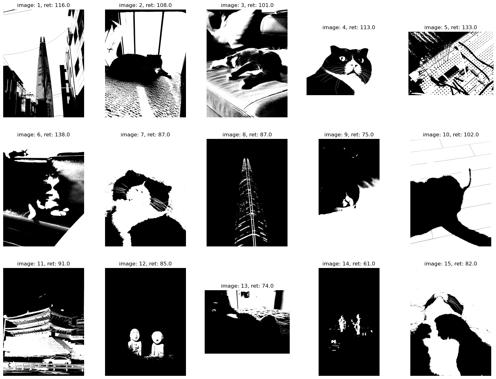
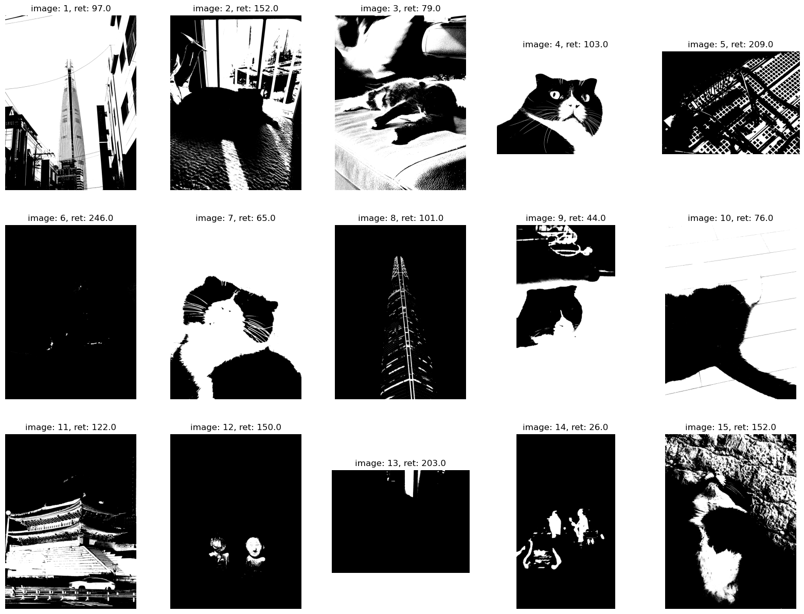

# Day5

## 채널 처리 함수

-----

특정 영역에서 색만 분리할 수 있음

- Grayscale은 이미지가 단순하기 때문에 complexity가 줄어듦
- 적절한 threshold만 준다면 쉽게 객체를 분리할 수 있다.

<br>

## 이미지 사칙 연산

---


[And Or Not Xor가 가능하면 영상에서 원하는 영역를 제거 또는 남길 수 있다.](./day5_1.py)

`cv2.bitwise_and(src1, src2, mask)` -> 비트별 논리곱 연산 수행

`cv2.bitwise_or(src1, src2, mask)` -> 비트별 논리합 연산 수행

`cv2.bitwise_xor(src1, src2, mask)` -> 비트별 배타적 논리합 연산 수행

`cv2.bitwise_not(src1, src2, mask)` -> 비트별 보수 연산 수행 (반전처리)


### Threshold

색 영상에서 특정한 패턴을 뽑아내고 합성하는 방법

```python
masks = cv2.threshold(logo, 220, 255, cv2.THRESH_BINARY)[1]  # 로고 영상 이진화
masks = cv2.split(masks)

fg_pass_mask = cv2.bitwise_or(masks[0], masks[1])       # 전경 통과 마스크
fg_pass_mask = cv2.bitwise_or(masks[2], fg_pass_mask)
bg_pass_mask = cv2.bitwise_not(fg_pass_mask)            # 배경 통과 마스크
```

마스크 이미지로 분리 할 수 있다.

| Foreground Pass Mask                                             | Background Pass Mask                                                  |
|------------------------------------------------------------------|-----------------------------------------------------------------------|
|      |  |
| 전경 클리핑 결과                                                        | 배경 클리핑 결과                                                             |
|  |  |

<br>

## 원소의 절댓값 연산

---

영상에서 음수로 이루어진 픽셀 영상을 재생시키면 보이지 않을 수도 있다.  

떄론 이미지와 이미지 사이 연산을 진행할 때 결과값이 음수로 계산될 수 있는 상황(검은색에서 흰색을 뺄 때)이 있다.
이렇게 된다면 영상의 특성을 잃어버리는 경우가 있다.

따라서 특성을 살리면서 빼기 위해선 절대값 연산이 필요하다.

입력 이미지와 타겟 이미지를 입력했을 때 타겟 이미지의 특성을 잃어버릴 수 있음 (극단적으로 -255로 치우친다거나 0에 수렴한다거나) 하지만 타겟 이미지의 값을 원할 수 있는 상황이 있다.

필요에 따라 영상의 특성을 살릴 수 있다. (음의 채널값을 사용할 수 있게 한다.)

|                               원본 이미지 1                                |                                원본 이미지                                 |
|:---------------------------------------------------------------------:|:---------------------------------------------------------------------:|
|  |  |
|                              img1 - img2                              |                              img2 - img1                              |
|  |  |
|                           abs(img1 - img2)                            |                           abs(img2 - img1)                            |                                                                      |    
|  |  |


```python
cv2.subtract(src1, src2)  # src1영상과 src2영상이 차이를 반환한다.
cv2.absdiff(src1, src2)   # src1영상과 src2영상의 차이의 절대값을 반환한다.
```

<br>

## 원소의 최솟값과 최댓값

`cv2.min(src1, src2)` -> src1과 src2 중 작은 값을 반환함

`cv2.max(src1, src2)` -> src1과 src2 중 큰 값을 반환함

`cv2.minMaxLoc(src, minVal, maxVal, minLoc, maxLoc, mask)` -> 행렬 또는 영상에서 최대, 최소값 그리고 그것의 위치를 찾아줌


```python
(min_val, max_val, _, _) = cv2.minMaxLoc(image)  # 최솟값과 최댓값 가져오기

ratio = 255 / (max_val - min_val)
dst = np.round((image - min_val) * ratio).astype('uint8')
(min_dst, max_dst, _, _) = cv2.minMaxLoc(dst)
```

다만 모든 영상에 적용되는 것은 아니다.

* 영상이 어두운 쪽이라면
  * 차이가 작을 것이다. → ratio가 커져서 어두운 영상이 밝아질 것이기 때문이다.

  <br>

* 영상이 전체적으로 밝고 일부 어둡다면
  * 해당하는 ratio가 1이라서 크게 올라가진 않을 것이다.

  <br>

* 영상이 더 어두웠다면
  * 배경속에 숨어있는 전경이 뚜렷하게 보이지 않았을 것이다.


      만약 이 상황에서 엣지를 검출한다면? 
      --
      제대로 검출되지 않을 것이다. 
      일부로 영상의 밝기를 올려 detection을 수행해야한다.
      엣지는 최대한 밝은 이미지에서 검출이 잘 수행된다. → 하지만 무조건 영상의 밝기를 올린다고 해결되진 않는다.

| 이미지 1                                                                  | 이미지 2                                                                  |
|------------------------------------------------------------------------|------------------------------------------------------------------------|
|  |  |


<br>

## 이미지 처리 통계 관련 함수

---

`Numpy`에서도 관련 기능을 사용할 수 있지만 `OpenCV`는 이미지 처리에 맞게 설계되어 있어서 이미지에 관한 통계 정보나 연산이 필요할 땐 `OpenCV`가 적합 할 수도 있다. 

`cv2.sumElems` -> 각 채널별 원소들의 합을 계산하여 스칼라값 반환한다.

`cv2.mean` -> 각 채널별 원소들의 평균을 계산하여 스칼라값 반환한다.

`cv2.meanStdDev` -> 배열 원소들의 평균과 표준편차를 계산한다.

`cv2.countNonZero` -> 0이 아닌 배열 원소의 개수를 반환한다.

`cv2.reduce` -> 행렬의 열/행 방향으로 옵션에 따라 축소한다.

`cv2.sort` -> 행렬의 각 행 혹은 각 열의 방향으로 정렬한다.

<br>

## 영상 화소의 접근

---

[가지고 있는 이미지 중 GrayScale 이미지 열어서 반전영상을 만들어보자.](./day5_2.py)

```python
import cv2
import numpy as np
from tqdm import tqdm

image = cv2.imread('./IMG_0033.jpeg', cv2.IMREAD_GRAYSCALE)
before_image = image.copy()

MAX_PIXEL = 255

def mat_access_direct_access(mat):
    pbar = tqdm(total=mat.shape[0] * mat.shape[1])

    for i in range(mat.shape[0]):
        for j in range(mat.shape[1]):
            k = mat[i, j]  # 원소 접근 - mat1[i][j] 방식도 가능
            mat[i, j] = MAX_PIXEL - k  # 원소 할당
            pbar.update(1)

    pbar.close()

mat_access_direct_access(image)

cv2.imshow('gray', np.vstack([before_image, image]))
cv2.waitKey()
```

|                이미지 픽셀값에 접근하여 Grayscale invert image 생성           |
|:----------------------------------------------------------------------:|
|  |

[이미지 픽셀값 처리는 다음과 같이 해볼 수 있다.](./day5_3.py)

1. numpy 배열 자체로 접근
2. item() 함수로 접근
3. lookup table로 접근
4. OpenCV에서 제공하는 함수로 접근
5. numpy.ndarray 연산 방식

```python
time_check(pixel_access1, "[방법1] 직접 접근 방식")
time_check(pixel_access2, "[방법2] item() 함수 접근 방식")
time_check(pixel_access3, "[방법3] lookup table 방식")
time_check(pixel_access4, "[방법4] OpenCV 함수  방식")
time_check(pixel_access5, "[방법5] ndarray 연산 방식")
```

```python
def pixel_access1(image):
    canvas = np.zeros(image.shape[:2], image.dtype)
    for i in range(image.shape[0]):
        for j in range(image.shape[1]):
            canvas[i, j] = 255 - image[i, j]

    return canvas

def pixel_access2(image):
    tmp = np.zeros(image.shape[:2], image.dtype)

    for i in range(image.shape[0]):
        for j in range(image.shape[1]):
            tmp.itemset((i, j), 255 - image.item(i, j))

    return tmp

def pixel_access3(image):
    lut = [255 - i for i in range(256)]
    lut = np.array(lut, np.uint8)
    return lut[image]

def pixel_access4(image):
    return cv2.subtract(255, image)

def pixel_access5(image):
    return 255 - image
```

| 방식에 따른 접근 시간 측정 결과 | 시간 [ms] |
|-------------------------|:-------:|
| 1. numpy 배열 직접 접근    |  1016   |
| 2. item() 함수로 접근     |   143   |
| 3. lookup table로 접근 |  1.66   |
| 4. OpenCV에서 제공하는 함수로 접근 |  0.284  |
| 5. numpy.ndarray 연산 방식 |  0.077  |

<br>

[이미지의 ROI 영역을 지정하여 픽셀값에 접근 할 수 있다.](day5_4.py)

```python
import cv2
import numpy as np

if __name__ == "__main__":
    image = cv2.imread('./IMG_0033.jpeg', cv2.IMREAD_GRAYSCALE)

    x = int(np.random.randint(0, image.shape[1], 1))
    y = int(np.random.randint(0, image.shape[0], 1))

    roi = image[y:y+150, x:x+100]

    for i in range(roi.shape[1]):
        for j in range(roi.shape[0]):
            print(roi[j, i], end=' ')
        print()

    cv2.imshow('title', roi)
    cv2.waitKey()
```

| 이미지 픽셀값 출력 | 이미지 ROI 표시 |
|---------------|---------------|
|||


<br>

### modulo 방식과 saturation 방식

* modulo 방식:  255 + x의 연산 결과는 255 % x로 값이 바뀌어
  * 이미지 결과가 의도하는 바와 달라질 수 있다.

* saturation → 255 + x의 연산 결과는 최대값 255로 고정된다.


<br>
<br>

## 연습문제

---

threshold는 gausian 분포가 잘되어 있다는 가정에서 128 기점으로 해서 영상을 이진처리를 한다.

* 여러개 이미지 샘플을 확보해서 적절히 이진 처리를 하는 코드를 작성한다.
* 극단으로 치우쳐진 영상을 확보해서 threshold를 찾아본다.
* 기존에 어떤 방식으로 했는지 찾아본다.
* 기존의 방식을 직접 구현해보거나 본인이 새롭게 제안한 방법을 좀 더 좋게 만들 수 있게 코드를 작성한다.


### [Answer: 히스토그램의 극대, 극소값을 사용하여 이진영상으로 분할해보자](./day5_5_find_my_binarization_method.ipynb)


```python
...

histograms = np.log(np.bincount(image.reshape(-1)))
calc_diff = np.zeros(shape=(255, 2))

for i in range(len(histograms)-1):
    calc_diff[i, 0] = i
    calc_diff[i, 1] = histograms[i+1] - histograms[i]

changed_point = []

for i in range(len(histograms)-2):
    if calc_diff[i, 1] * calc_diff[i+1, 1] < 0:
        changed_point.append([i, calc_diff[i, 1] * calc_diff[i+1, 1]])
        
thresh_value = int(sorted(changed_point, key=lambda x: x[1])[-1][0])

ret, mine_image = cv2.threshold(image, thresh_value, 255, cv2.THRESH_BINARY)

...
```


| OTSU 알고리즘 결과                                                         |                           히스토그램 극값 방식의 결과                            |
|----------------------------------------------------------------------|:--------------------------------------------------------------------:|
|  |  |